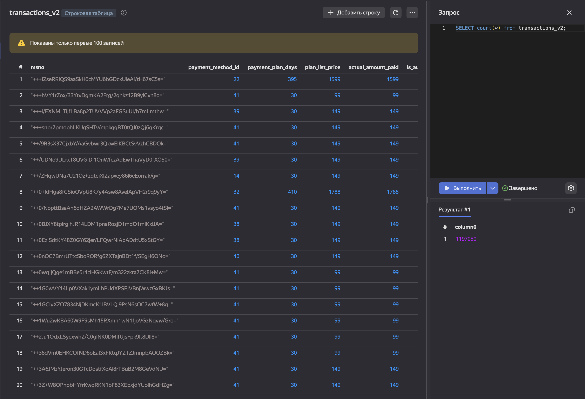
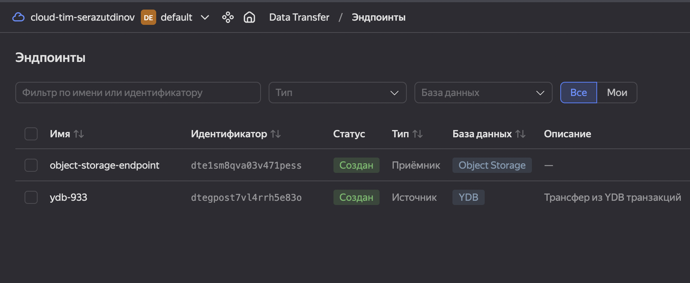
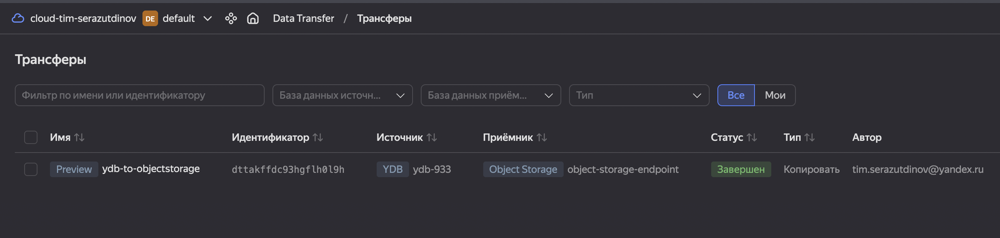
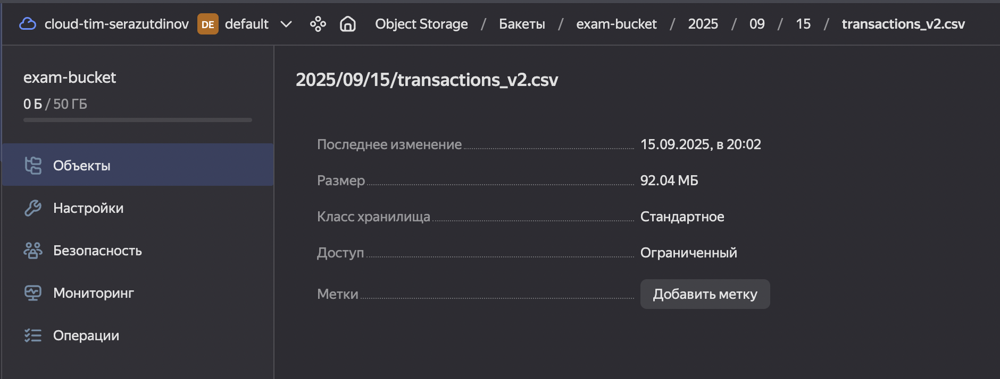
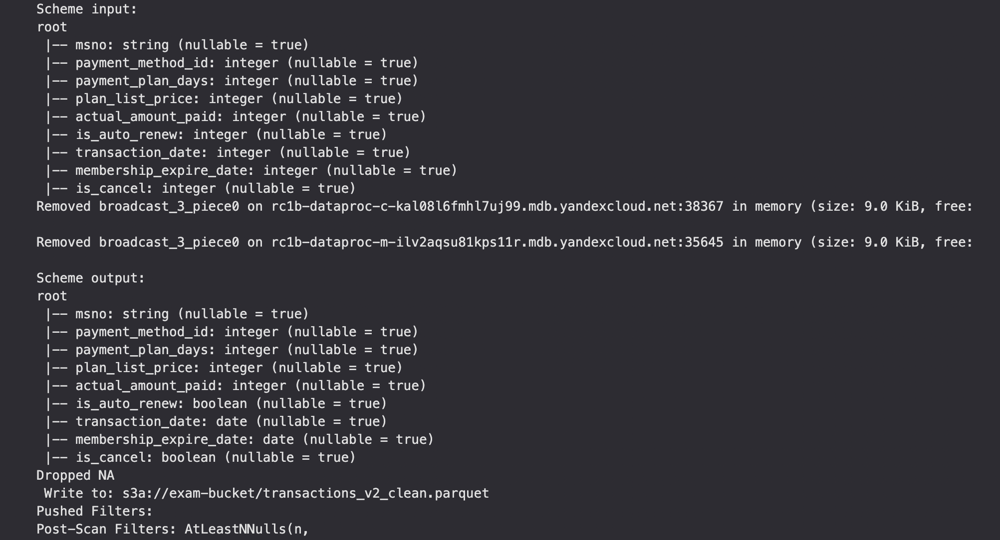
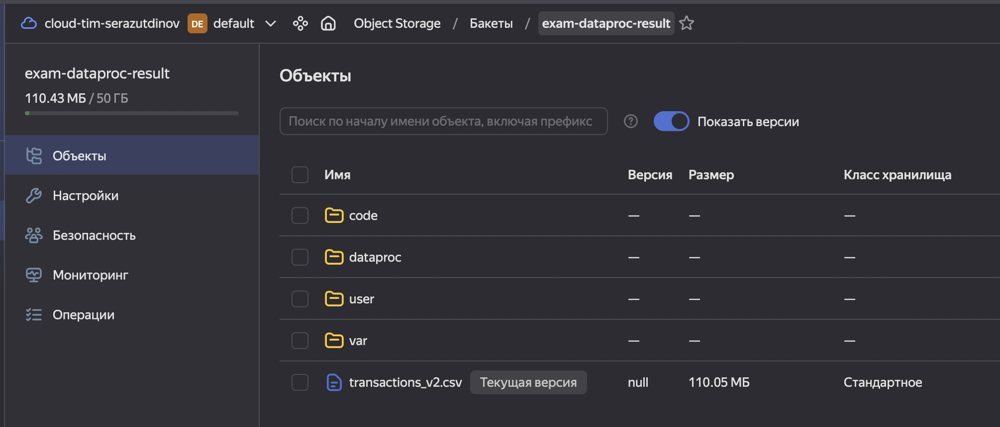
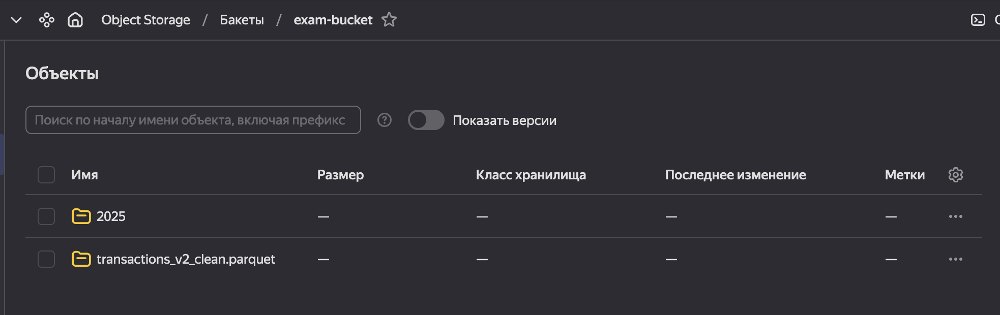
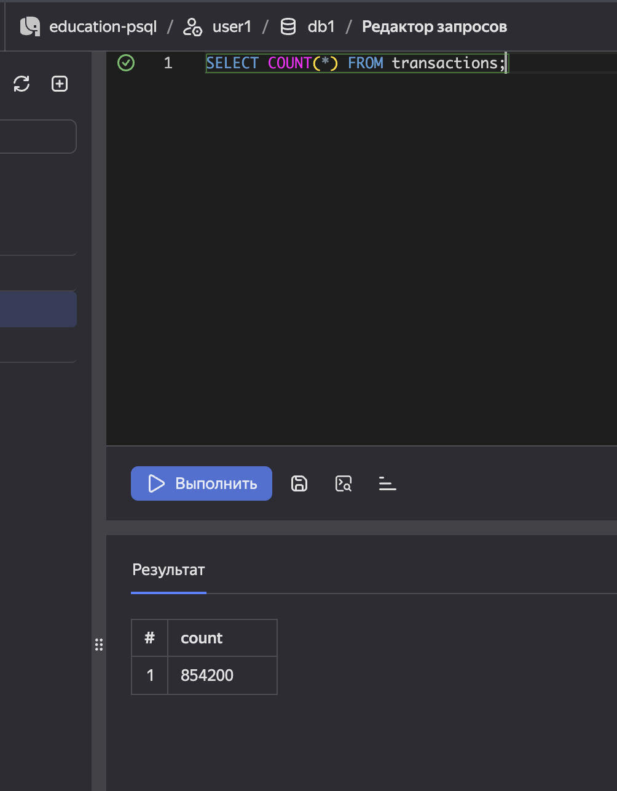
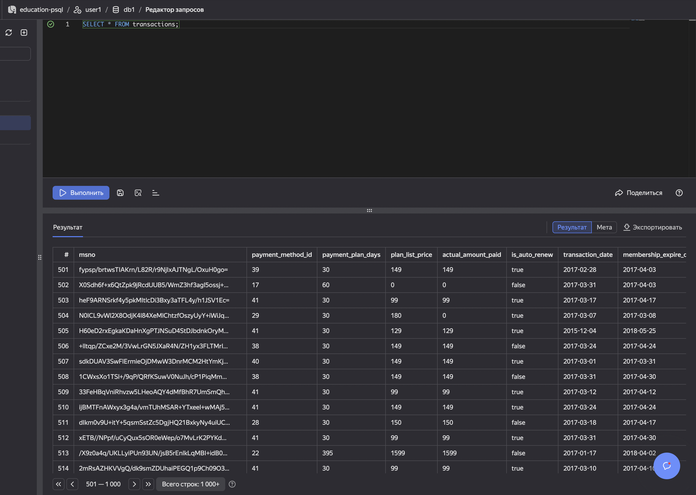
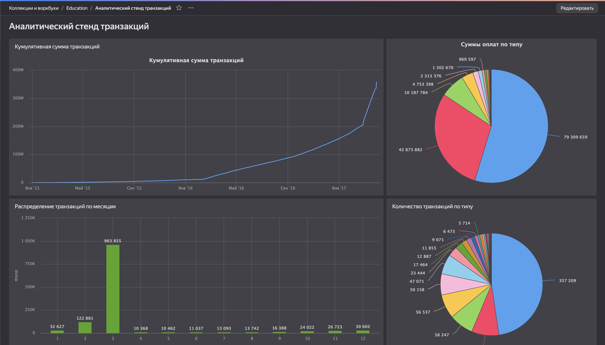

# ETL Exam Project

---

## 📌 Этапы работы

### 1. Подготовка данных и трансфер данных
- Исходный датасет транзакций был загружен в **Yandex Object Storage**.
- В `exe1/code/create_transactions_v2.yql` описан скрипт подготовки данных для YDB.
- С помощью `ydb_connect.bash` и `ydb_import.bash` данные импортировались в YDB.
- Был реализован трансфер данных из YDB в Object Storage с помощью Data Transfer.
    - Были созданы источник и приемник
    - Бакет для приема данных
    - Сам объект трансфера (его конфигурация)

    
<b>Скриншоты</b>

    - 
    - 
    - 
    - 

 

### 2. Airflow + Dataproc
- Создан DAG (`exe2/code/dag.py`), который оркестрирует запуск Spark-задач на Dataproc.
- Логика обработки вынесена в `job.py`.
- Dataproc использовался для подготовки и трансформации данных.

    
<b>Скриншоты</b>

    - 
    - 
    - 

 

### 3. Kafka + Spark Streaming
- Реализован **writer** (`kafka_write.py`), который считывает данные из Parquet и отправляет батчи сообщений в Kafka.
- Реализован **reader** (`kafka_read.py`), который:
  - читает поток из Kafka,
  - парсит JSON по схеме,
  - записывает результат в PostgreSQL.
- Данные потоково загружались в кластер **Managed PostgreSQL** в таблицу `transactions`.
- Пример содержимого таблицы:

### 4. Визуализация в DataLens
- Настроено подключение PostgreSQL к DataLens (см. [datalens_connect.png](exe4/datalens_connect.png)).
- Построен дашборд с аналитикой транзакций:

**Содержимое дашборда:**
- 📈 Кумулятивная сумма транзакций во времени  
- 🥧 Суммы оплат по типам  
- 📊 Распределение транзакций по месяцам  
- 🥧 Количество транзакций по типам  

---

## 🚀 Использованные технологии
- **Yandex Cloud** (Object Storage, YDB, Dataproc, Managed Kafka, Managed PostgreSQL, DataLens)
- **Apache Spark 3.0.3** (Structured Streaming)
- **Apache Kafka**
- **Airflow**
- **PostgreSQL**
- **Python / PySpark**

---

## 📎 Репозиторий
[github.com/tmanspace/etl_exam](https://github.com/tmanspace/etl_exam)
